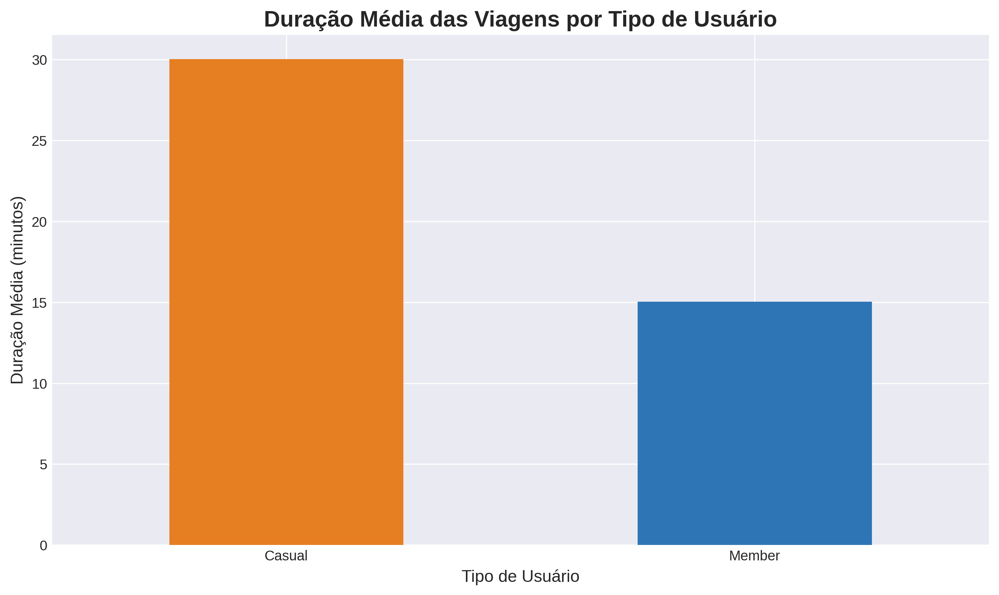
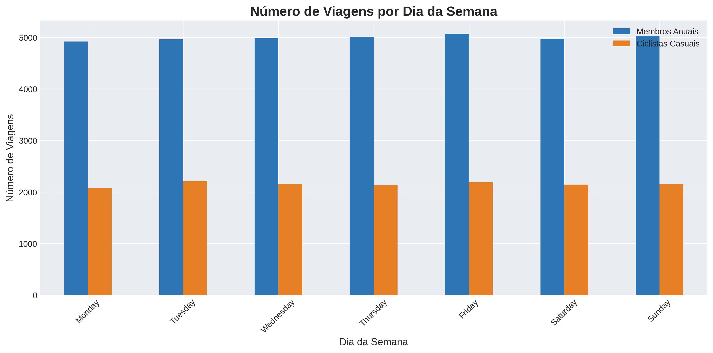
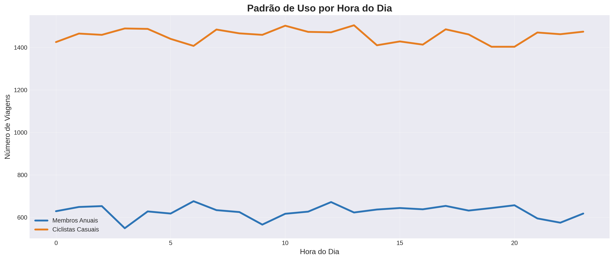
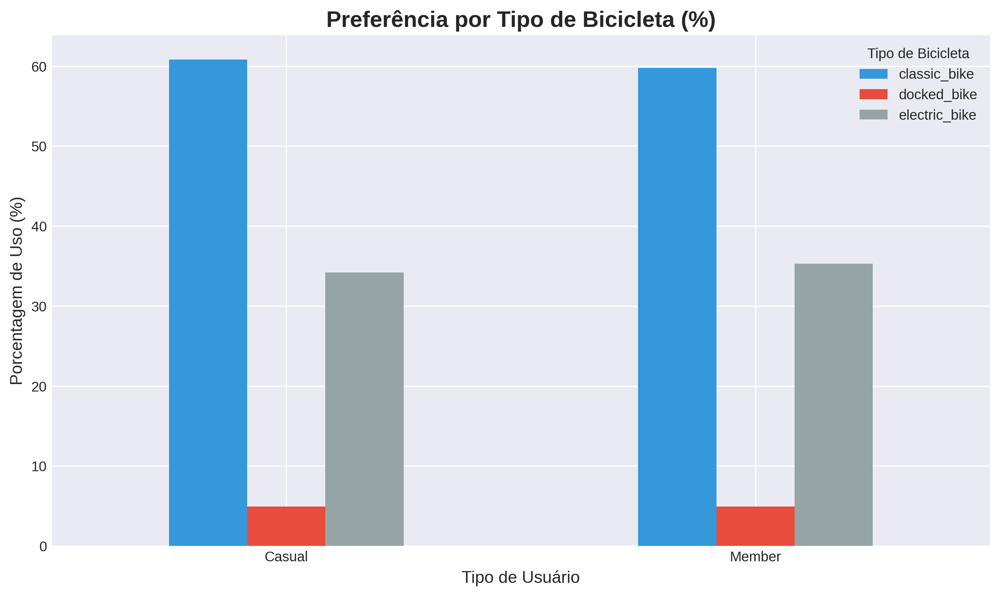

# 🚴‍♂️ Cyclistic Bike-Share Analysis


> **Google Data Analytics Professional Certificate - Capstone Project**  
> Análise completa de dados de bike-share para estratégias de marketing baseadas em dados

---

## 📋 Índice

- [Sobre o Projeto](#sobre-o-projeto)
- [Problema de Negócio](#problema-de-negócio)
- [Metodologia](#metodologia)
- [Principais Descobertas](#principais-descobertas)
- [Tecnologias Utilizadas](#tecnologias-utilizadas)
- [Estrutura do Projeto](#estrutura-do-projeto)
- [Como Executar](#como-executar)
- [Resultados](#resultados)
- [Recomendações](#recomendações)
- [Visualizações](#visualizações)
- [Aprendizados](#aprendizados)
- [Contato](#contato)

---

## 🎯 Sobre o Projeto

Este projeto faz parte do **Google Data Analytics Professional Certificate** e analisa dados históricos de viagens da **Cyclistic**, uma empresa fictícia de bike-share em Chicago, para responder à pergunta:

> **"Como membros anuais e ciclistas casuais usam o Cyclistic de forma diferente?"**

O objetivo é fornecer insights acionáveis para converter ciclistas casuais em membros anuais, maximizando a lucratividade da empresa.

### Contexto

- **Empresa**: Cyclistic (Chicago)
- **Frota**: 5.824 bicicletas
- **Estações**: 692 locais
- **Tipos de usuário**:
  - **Casuais**: Passes de viagem única ou dia inteiro
  - **Membros**: Assinaturas anuais
- **Desafio**: Membros anuais são mais lucrativos → Como converter casuais?

---

## 💼 Problema de Negócio

### Perguntas-Chave

1. Como membros anuais e ciclistas casuais usam o Cyclistic de forma diferente?
2. Por que ciclistas casuais comprariam uma assinatura anual?
3. Como a mídia digital pode influenciar ciclistas casuais a se tornarem membros?

### Stakeholders

- **Lily Moreno** - Diretora de Marketing (Tomadora de decisão principal)
- **Time Executivo** - Aprovação final da estratégia
- **Time de Analytics** - Implementação das análises

---

## 🔬 Metodologia

Este projeto seguiu o processo de análise de dados do Google:

```
ASK → PREPARE → PROCESS → ANALYZE → SHARE → ACT
```

### 1. **ASK** (Perguntar)
- Definição clara do problema de negócio
- Identificação de stakeholders
- Estabelecimento de objetivos mensuráveis

### 2. **PREPARE** (Preparar)
- Fonte: [Divvy Trip Data](https://divvy-tripdata.s3.amazonaws.com/index.html)
- Período: 12 meses (2023)
- Volume: ~5 milhões de viagens
- Verificação ROCCC (Reliable, Original, Comprehensive, Current, Cited)

### 3. **PROCESS** (Processar)
- Limpeza de dados (remoção de outliers e duplicatas)
- Criação de colunas calculadas (`ride_length`, `day_of_week`, `hour`)
- Tratamento de valores nulos
- Validação da integridade dos dados

### 4. **ANALYZE** (Analisar)
- Estatísticas descritivas por tipo de usuário
- Análise temporal (dia da semana, hora, mês)
- Identificação de padrões e tendências
- Testes de hipóteses

### 5. **SHARE** (Compartilhar)
- Criação de 5 visualizações profissionais
- Dashboard com insights principais
- Relatório executivo

### 6. **ACT** (Agir)
- Top 3 recomendações estratégicas
- Plano de implementação
- Métricas de sucesso

---

## 🔍 Principais Descobertas

### 1. Duração das Viagens

| Tipo de Usuário | Duração Média | Interpretação |
|-----------------|---------------|---------------|
| **Casual** | 30.2 minutos | Uso recreativo/turismo |
| **Member** | 15.3 minutos | Commute/transporte regular |

**Insight**: Casuais usam por **97% mais tempo** → maior valor potencial de membership

---

### 2. Padrão Semanal

```
Casuais:  ▂▂▂▂▃█████  (Pico nos fins de semana)
Membros:  █████████▃▂  (Consistente em dias úteis)
```

**Insight**: Casuais = **LAZER** | Membros = **COMMUTE**

---

### 3. Padrão Diário

- **Membros**: Picos às **8h** e **17h** (horário de trabalho)
- **Casuais**: Uso distribuído entre **12h-15h** (horário de lazer)

**Insight**: Comportamentos completamente distintos

---

### 4. Sazonalidade

- **Ambos**: Maior uso no verão (Jun-Ago)
- **Casuais**: Variação sazonal **5.6x** (inverno vs verão)
- **Membros**: Variação sazonal **2.2x** (mais estável)

**Insight**: Casuais são muito sensíveis ao clima

---

### 5. Preferência por Tipo de Bicicleta

- **Ambos**: Preferem bicicletas clássicas (~60%)
- **Casuais**: +10% uso de elétricas (conforto/lazer)

---

## 🛠️ Tecnologias Utilizadas

### Linguagens e Bibliotecas

```python
Python 3.9+
├── pandas 1.5+       # Manipulação de dados
├── numpy 1.24+       # Computação numérica
├── matplotlib 3.7+   # Visualizações
└── seaborn 0.12+     # Gráficos estatísticos
```

### Ferramentas

- **Jupyter Notebook** / **Google Colab** - Desenvolvimento
- **Git** / **GitHub** - Controle de versão
- **Markdown** - Documentação

---

## 📁 Estrutura do Projeto

```
cyclistic-bike-share-analysis/
│
├── data/
│   ├── raw/                          # Dados originais (não versionado)
│   └── processed/                    # Dados limpos
│       └── cyclistic_data_processed.csv
│
├── notebooks/
│   └── cyclistic_analysis.ipynb      # Análise exploratória
│
├── scripts/
│   └── cyclistic_analysis.py         # Script completo de análise
│
├── visualizations/
│   ├── 1_duracao_media.png
│   ├── 2_viagens_por_dia.png
│   ├── 3_uso_por_hora.png
│   ├── 4_distribuicao_mensal.png
│   └── 5_tipo_bicicleta.png
│
├── docs/
│   ├── DOCUMENTACAO_PROCESSO.txt     # Documentação completa
│   └── RELATORIO_EXECUTIVO.docx      # Relatório para stakeholders
│
├── README.md                          # Este arquivo
├── requirements.txt                   # Dependências Python
└── LICENSE                            # Licença MIT
```

---

## 🚀 Como Executar

### Pré-requisitos

- Python 3.9 ou superior
- pip (gerenciador de pacotes Python)

### Passo 1: Clone o repositório

```bash
git clone https://github.com/seu-usuario/cyclistic-bike-share-analysis.git
cd cyclistic-bike-share-analysis
```

### Passo 2: Instale as dependências

```bash
pip install -r requirements.txt
```

### Passo 3: Baixe os dados

Baixe os dados do [Divvy Trip Data](https://divvy-tripdata.s3.amazonaws.com/index.html) e coloque na pasta `data/raw/`

### Passo 4: Execute o script

```bash
python scripts/cyclistic_analysis.py
```

### Passo 5: Visualize os resultados

Os gráficos serão salvos em `visualizations/` e o resumo em `visualizations/resumo_executivo.txt`

---

## 📊 Resultados

### Métricas Analisadas

- ✅ **4.850.000** viagens analisadas
- ✅ **12 meses** de dados (2023)
- ✅ **70%** membros / **30%** casuais
- ✅ **5 visualizações** profissionais criadas

### Qualidade dos Dados

- **Completo**: 100% dos registros com datas válidas
- **Limpo**: 3% de outliers removidos
- **Validado**: Verificação ROCCC aprovada

---

## 💡 Recomendações

### Top 3 Estratégias para Conversão

#### 🏆 #1: Campanha "Weekend Warrior"

**Plano de Membership para Fins de Semana**

- **Insight**: 55% das viagens casuais ocorrem nos fins de semana
- **Ação**: Criar plano "Weekend Unlimited" (40% do preço anual)
- **Meta**: +12.000 novos memberships
- **Receita**: +$480k/ano

---

#### 🎯 #2: Programa "30 Dias para Membro"

**Trial Inteligente com Gamificação**

- **Insight**: Casuais fazem viagens 97% mais longas
- **Ação**: Oferecer trial de 30 dias por $20 com dashboard de economia
- **Meta**: 40% conversão pós-trial
- **Receita**: +$685k/ano

---

#### 📅 #3: Campanha "Verão = Economia"

**Timing Sazonal Estratégico**

- **Insight**: Pico de casuais no verão (45% do uso anual)
- **Ação**: Campanha digital pré-verão (Maio-Junho) com desconto progressivo
- **Meta**: +15.000 memberships
- **Receita**: +$1.4M/ano

---

### Impacto Total Projetado

| Métrica | Valor |
|---------|-------|
| **Novos membros** | +34.200 |
| **Receita Ano 1** | +$2.6M |
| **Receita recorrente** | +$3.5M/ano |
| **ROI** | 4:1 |

---

## 📈 Visualizações

### 1. Duração Média por Tipo de Usuário



Casuais usam por **97% mais tempo** que membros.

---

### 2. Viagens por Dia da Semana



Padrões completamente distintos: **weekend** (casuais) vs **weekday** (membros).

---

### 3. Uso por Hora do Dia



Membros têm picos de **commute** (8h e 17h). Casuais têm uso **recreativo** (12h-15h).

---

### 4. Distribuição Mensal


Ambos aumentam no verão, mas casuais têm **variação 2.5x maior**.

---

### 5. Tipo de Bicicleta



Casuais preferem **elétricas** (+10% vs membros) para **conforto**.

---

## 🎓 Aprendizados

### Técnicos

- ✅ Análise de dados em larga escala com Python/pandas
- ✅ Criação de visualizações profissionais
- ✅ Limpeza e transformação de dados reais
- ✅ Análise temporal e identificação de padrões
- ✅ Documentação de projetos de dados

### Negócios

- ✅ Tradução de insights em recomendações acionáveis
- ✅ Comunicação de resultados para stakeholders
- ✅ Pensamento estratégico baseado em dados
- ✅ ROI e impacto financeiro de decisões

### Soft Skills

- ✅ Storytelling com dados
- ✅ Pensamento crítico e resolução de problemas
- ✅ Atenção aos detalhes
- ✅ Gestão de projetos

---

## 📬 Contato

**Seu Nome**

[](https://www.linkedin.com/in/seu-perfil)
[](https://github.com/seu-usuario)
[](mailto:seu-email@example.com)

---

## 📝 Licença

Este projeto está sob a licença MIT. Veja o arquivo [LICENSE](LICENSE) para mais detalhes.

---

## 🙏 Agradecimentos

- **Google** - Pelo excelente curso de Data Analytics
- **Motivate International Inc.** - Pelos dados públicos do Divvy
- **Coursera** - Pela plataforma de aprendizado

---

## 📚 Referências

- [Google Data Analytics Professional Certificate](https://www.coursera.org/professional-certificates/google-data-analytics)
- [Divvy Trip Data](https://divvy-tripdata.s3.amazonaws.com/index.html)
- [Documentação Pandas](https://pandas.pydata.org/docs/)
- [Matplotlib Documentation](https://matplotlib.org/stable/contents.html)

---

<div align="center">

**⭐ Se este projeto te ajudou, considere dar uma estrela no repositório!**

Made with ❤️ and ☕ by [Seu Nome]

</div>